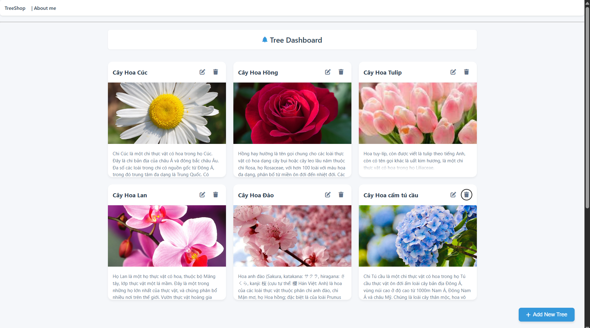
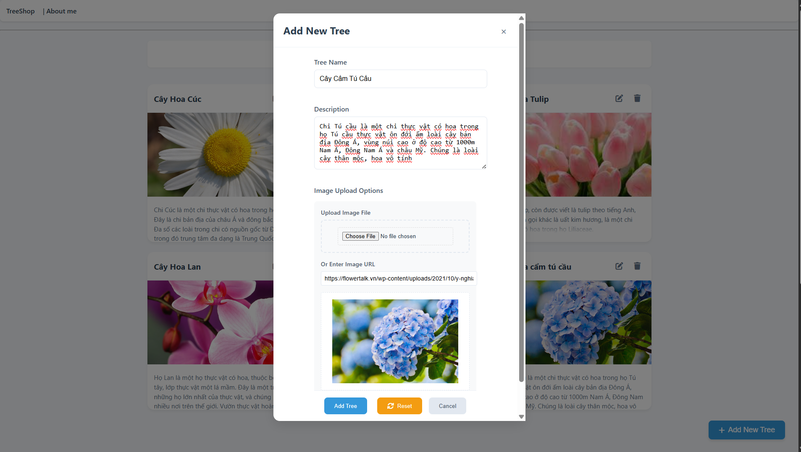
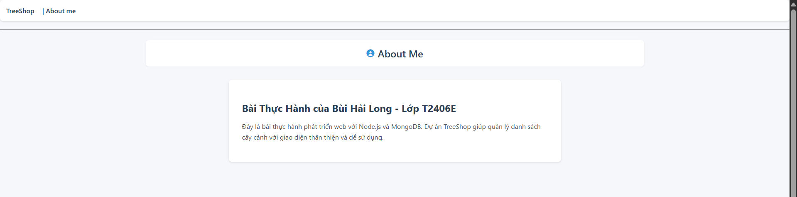
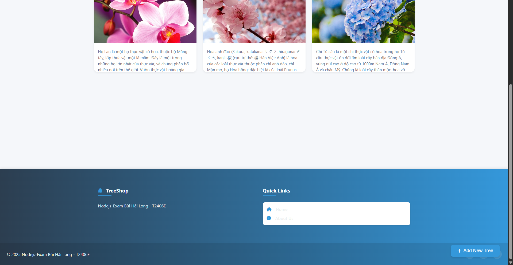
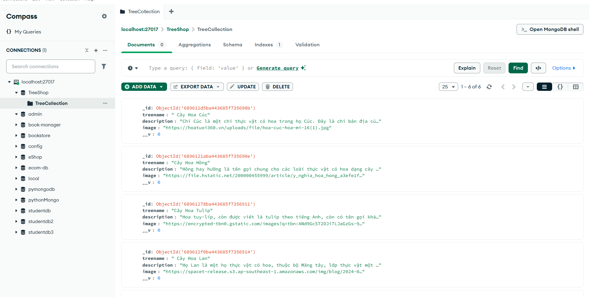

# TreeShop - CRUD
 BÀI THỰC THÀNH THÌ MÔN NODEJS CỦA BÙI HẢI LONG - T2406E
Download zip or git clone https://github.com/hailongtn/NodeJS-Practical-Test-T2406E-.git
 
Use  cd NAMEFOLDER

Run MongoDB locally, then `npm install` and `node server.js`.

Server run on ` http://localhost:3001 `.

   ⭐ Show all trees in the database to the website.

   ⭐ Add Form 

   ⭐ About page

   ⭐ Footer

 
   ⭐ MongoDb

   
